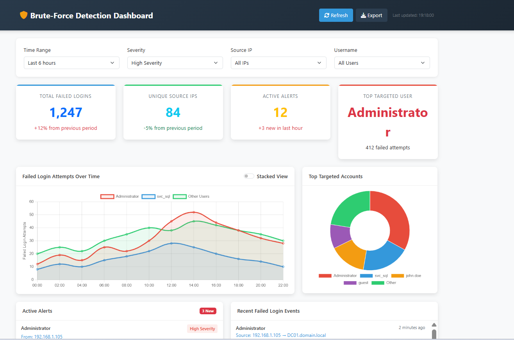

# Brute-Force Detection Dashboard

A comprehensive security monitoring dashboard for detecting and visualizing brute-force attacks through Windows Event ID 4625 monitoring.



## Features

### 🔒 Security Monitoring
- **Real-time failed login attempt tracking**
- **Windows Event ID 4625 visualization**  
- **Suspicious activity detection**
- **Brute-force attack pattern recognition**

### 📊 Data Visualization
- **Interactive timeline charts** (Chart.js)
- **Top targeted accounts breakdown**
- **Real-time metrics dashboard**
- **Responsive chart animations**

### ⚡ Alerting & Filtering
- **Active alerts with severity levels** (High/Medium)
- **Time range filtering** (1h, 6h, 24h, 7 days)
- **Source IP and username filtering**
- **Export functionality** for reports

### 🎨 User Experience
- **Responsive Bootstrap design**
- **Interactive hover effects and animations**
- **Real-time data refresh simulation**
- **Professional cybersecurity color scheme**

## Technologies Used

- **HTML5, CSS3, JavaScript**
- **Bootstrap 5** for responsive UI
- **Chart.js** for data visualization
- **Font Awesome** for icons

## Live Demo

[View Live Dashboard](https://vogonna.github.io/brute-force-detection-dashboard/)

## Installation

### Quick Start (Local)
1. Clone the repository:
```bash
git clone https://github.com/vogonna/brute-force-detection-dashboard.git

2. Navigate to the project directory:
```bash
cd brute-force-detection-dashboard